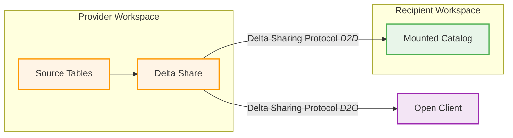

# Databricks Data Sharing and Collaboration

> **🎉 NEW: Interactive D2O Demo Available!**  
> Run a complete Databricks-to-Open Delta Sharing demo in Docker with Jupyter, pandas, and seaborn.  
> **[Get Started Now →](START-HERE.md)** | Just run: `.\run-d2o-demo.ps1`

This repository demonstrates various data sharing patterns between Databricks tenants, including Delta Sharing and data replication scenarios. It provides a complete end-to-end setup with automated workspace provisioning and hands-on demonstrations of cross-tenant data collaboration.

## Overview

The project showcases modern data sharing architectures where organizations can securely share data across different Databricks workspaces, cloud accounts, or even different cloud providers. This enables data collaboration while maintaining governance, security, and compliance requirements.

## Architecture

The following diagram illustrates the data sharing architecture with provider and recipient workspaces:



## What's Included

### 📁 Workspace Provisioning
- **Provider Workspace**: Complete infrastructure for data sharing provider
- **Recipient Workspace**: Complete infrastructure for data sharing recipient
- **StackQL-based Deployment**: Infrastructure as Code using SQL syntax
- **AWS Integration**: S3 storage, IAM roles, and cross-account access

### 📓 Notebooks and Demonstrations
- **Module 2 - Delta Sharing Deep Dive**: Comprehensive hands-on exercises
  - **2.1 DEMO**: Implementing Delta Sharing (Databricks-to-Databricks)
  - **2.2 LAB**: Hands-on implementation exercises
  - **2.3 DEMO**: Implementing Delta Sharing (Databricks-to-Open)
  - **2.4 DEMO**: Implementing Change Data Feed (CDF)

### 🔧 Key Features Demonstrated
- **Delta Sharing Protocol**: Secure, open-source data sharing
- **Unity Catalog Integration**: Centralized governance and metadata
- **Cross-tenant Authentication**: Token-based secure access
- **Real-time Data Feeds**: Change Data Feed (CDF) for incremental updates
- **External Client Support**: PowerBI, Python, and other external tools

## Data Sharing Patterns

### 1. Databricks-to-Databricks (D2D)
Secure data sharing between two Databricks workspaces with full Unity Catalog integration.

**Use Cases:**
- Inter-departmental data sharing
- Multi-cloud data collaboration
- Partner data exchange

### 2. Databricks-to-Open (D2O)
Share data with external tools and platforms using open Delta Sharing protocol.

**Use Cases:**
- Business intelligence tools (PowerBI, Tableau)
- Data science platforms
- Third-party analytics applications

**🎯 NEW: Interactive D2O Demo Available!**
- Complete Docker-based demonstration
- Jupyter notebook with pandas and seaborn
- Ready-to-run example with visualizations
- See **[START-HERE.md](START-HERE.md)** to get started!

### 3. Change Data Feed (CDF)
Stream incremental changes from provider to recipient for real-time data synchronization.

**Use Cases:**
- Real-time analytics
- Event-driven architectures
- Data pipeline synchronization

## Getting Started

### Quick Start: D2O Interactive Demo

**Want to see Delta Sharing in action right away?** Try our interactive D2O demo:

```powershell
# Windows
.\run-d2o-demo.ps1

# Linux/Mac  
./run-d2o-demo.sh
```

Then open http://localhost:8888 and run the Jupyter notebook!

👉 **Full instructions:** [START-HERE.md](START-HERE.md)

---

### 1. Prerequisites
- AWS account with appropriate permissions
- Databricks account with Unity Catalog enabled
- Python 3.8+ for StackQL deployment

### 2. Deploy Infrastructure
```bash
# Navigate to workspace provisioning
cd workspace_provisioning

# Set environment variables (see workspace_provisioning/README.md)
export AWS_REGION='us-east-1'
export AWS_ACCOUNT_ID='your-account-id'
export DATABRICKS_ACCOUNT_ID='your-databricks-account-id'
# ... other required variables

# Deploy provider workspace
stackql-deploy build provider_workspace dev \
  -e AWS_REGION=${AWS_REGION} \
  -e AWS_ACCOUNT_ID=${AWS_ACCOUNT_ID} \
  -e DATABRICKS_ACCOUNT_ID=${DATABRICKS_ACCOUNT_ID} \
  -e DATABRICKS_AWS_ACCOUNT_ID=${DATABRICKS_AWS_ACCOUNT_ID}

# Deploy recipient workspace
stackql-deploy build recipient_workspace dev \
  -e AWS_REGION=${AWS_REGION} \
  -e AWS_ACCOUNT_ID=${AWS_ACCOUNT_ID} \
  -e DATABRICKS_ACCOUNT_ID=${DATABRICKS_ACCOUNT_ID} \
  -e DATABRICKS_AWS_ACCOUNT_ID=${DATABRICKS_AWS_ACCOUNT_ID}
```

### 3. Run Demonstrations
1. Open the provider workspace and run the provider notebooks
2. Open the recipient workspace and run the recipient notebooks
3. Follow the step-by-step guides in each notebook

## Project Structure

```
databricks-data-sharing-and-collaboration/
├── README.md                                    # This file
├── START-HERE.md                                # 🎯 Quick start for D2O demo
├── DEMO-SUMMARY.md                              # Complete D2O demo overview
├── README-D2O-DEMO.md                           # D2O demo setup guide
├── QUICKSTART-D2O.md                            # D2O quick reference
├── ARCHITECTURE-D2O.md                          # D2O architecture diagrams
├── EXPECTED-OUTPUT.md                           # D2O expected outputs
│
├── run-d2o-demo.ps1                            # 🔥 Windows demo launcher
├── run-d2o-demo.sh                             # 🔥 Linux/Mac demo launcher
├── Dockerfile                                   # Docker container config
│
├── external_jupyter_notebooks/
│   └── d2o_example.ipynb                       # ⭐ D2O recipient demo
│
├── provider-notebooks/                          # Provider side notebooks
│   └── Module 2 - Delta Sharing Deep Dive/
│       ├── 2.1 DEMO Implementing Delta Sharing (D2D)/
│       ├── 2.2 LAB Implementing Delta Sharing (D2D)/
│       ├── 2.3 DEMO Implementing Delta Sharing (D2O)/  # Generates credentials
│       └── 2.4 DEMO Implementing Change Data Feed (CDF)/
│
├── recipient-notebooks/                         # Recipient side notebooks
│   └── Module 2 - Delta Sharing Deep Dive/
│
└── workspace_provisioning/                      # Infrastructure as Code
    ├── README.md                                # Deployment instructions
    ├── provider_workspace/                      # Provider infrastructure
    └── recipient_workspace/                     # Recipient infrastructure
```

## Key Benefits

### 🔐 Security & Governance
- **Token-based Authentication**: Secure access without data movement
- **Fine-grained Permissions**: Table and column-level access control
- **Audit Logging**: Complete data access audit trails
- **Data Lineage**: Track data usage across workspaces

### 🚀 Performance & Efficiency
- **Zero-copy Sharing**: No data duplication or movement
- **Delta Lake Optimization**: Leverages Delta Lake's performance features
- **Incremental Updates**: Efficient change propagation via CDF
- **Caching**: Intelligent data caching for improved performance

### 🌐 Interoperability
- **Open Protocol**: Works with any Delta Sharing compatible tool
- **Multi-cloud Support**: Share data across different cloud providers
- **Standard APIs**: REST-based APIs for integration
- **Ecosystem Integration**: Works with BI tools, ML platforms, and more

## Learning Objectives

After completing this project, you will understand:

1. **Delta Sharing Fundamentals**: Core concepts and architecture
2. **Workspace Setup**: End-to-end infrastructure provisioning
3. **Data Provider Patterns**: How to create and manage data shares
4. **Data Consumer Patterns**: How to consume shared data securely
5. **External Integration**: Connecting external tools to shared data
6. **Change Data Feeds**: Real-time data synchronization patterns
7. **Governance**: Security, permissions, and compliance considerations

## Technologies Used

- **Databricks**: Unified analytics platform
- **Delta Lake**: Open-source storage layer
- **Delta Sharing**: Open protocol for secure data sharing
- **Unity Catalog**: Unified governance for data and AI
- **StackQL**: SQL-based Infrastructure as Code
- **AWS**: Cloud infrastructure (S3, IAM, etc.)

## Support and Resources

- 📖 **Documentation**: Detailed setup instructions in `workspace_provisioning/README.md`
- 🛠️ **Troubleshooting**: Common issues and solutions in individual README files
- 🔗 **StackQL**: [https://stackql.io](https://stackql.io)
- 🔗 **Delta Sharing**: [https://delta.io/sharing](https://delta.io/sharing)
- 🔗 **Databricks**: [https://docs.databricks.com](https://docs.databricks.com)

## Contributing

Contributions are welcome! Please read the contributing guidelines and submit pull requests for any improvements.

## License

This project is licensed under the MIT License - see the LICENSE file for details.

---

*This project demonstrates the power of modern data sharing with Databricks and Delta Sharing protocol, enabling secure and efficient data collaboration across organizational boundaries.*