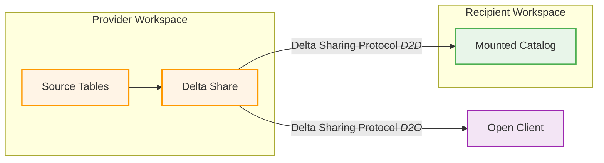

# Databricks Data Sharing and Collaboration

This repository demonstrates various data sharing patterns between Databricks tenants, including Delta Sharing and data replication scenarios. It provides a complete end-to-end setup with automated workspace provisioning and hands-on demonstrations of cross-tenant data collaboration.

## Overview

The project showcases modern data sharing architectures where organizations can securely share data across different Databricks workspaces, cloud accounts, or even different cloud providers. This enables data collaboration while maintaining governance, security, and compliance requirements.

## Architecture

The following diagram illustrates the data sharing architecture with provider and recipient workspaces:



## What's Included

### Workspace Provisioning (deployed using [`stackql`](https://github.com/stackql/stackql))

| Component | Directory | Description |
|------------|------------|-------------|
| **Provider Workspace** | `workspace_provisioning/provider_workspace` | Complete infrastructure for data sharing provider. |
| **Recipient Workspace** | `workspace_provisioning/recipient_workspace` | Complete infrastructure for data sharing recipient. |

> Workspaces are deployable via [GitHub Actions](.github/workflows/databricks-workspace-provisioning.yml) as well

### Notebooks and Demonstrations

| Component | Directory | Description |
|------------|------------|-------------|
| **Provider Notebooks** | `provider-notebooks` | Included automatically in the provider workspace, used to set up tables and create shares and recipients. |
| **Recipient Notebooks (D2D)** | `recipient-notebooks` | Included automatically in the recipient workspace, used to mount and read data from shared tables. |
| **Jupyter Notebooks (D2O)** | `external_jupyter_notebooks` | Deployed using Docker, used to demonstrate the `delta_sharing` open client. |

## Deployment

Follow the steps below to deploy the provider and recipient workspaces to demonstrate Delta Sharing

### 1. Prerequisites
- AWS account with appropriate permissions
- Databricks account with Unity Catalog enabled
- Python 3.8+ for StackQL deployment

### 2. Deploy Infrastructure
```bash
# Navigate to workspace provisioning
cd workspace_provisioning

# Set environment variables (see workspace_provisioning/README.md)
export DATABRICKS_AWS_ACCOUNT_ID=414351767826
export AWS_ACCOUNT_ID='your-account-id'
export DATABRICKS_ACCOUNT_ID='your-databricks-account-id'
export DATABRICKS_CLIENT_ID='your-client-id'
export DATABRICKS_CLIENT_SECRET='your-client-secret'
export AWS_ACCESS_KEY_ID='YOURAWSACCESSKEY'
export AWS_SECRET_ACCESS_KEY= 'YOURAWSSECRETACCESSKEY'

# Deploy provider workspace
stackql-deploy build provider_workspace dev \
  -e AWS_REGION=${AWS_REGION} \
  -e AWS_ACCOUNT_ID=${AWS_ACCOUNT_ID} \
  -e DATABRICKS_ACCOUNT_ID=${DATABRICKS_ACCOUNT_ID} \
  -e DATABRICKS_AWS_ACCOUNT_ID=${DATABRICKS_AWS_ACCOUNT_ID}

# Deploy recipient workspace
stackql-deploy build recipient_workspace dev \
  -e AWS_REGION=${AWS_REGION} \
  -e AWS_ACCOUNT_ID=${AWS_ACCOUNT_ID} \
  -e DATABRICKS_ACCOUNT_ID=${DATABRICKS_ACCOUNT_ID} \
  -e DATABRICKS_AWS_ACCOUNT_ID=${DATABRICKS_AWS_ACCOUNT_ID}
```

### 3. Run Demonstrations
1. Open the provider workspace and run the provider notebooks
2. Open the recipient workspace and run the recipient notebooks
3. Follow the step-by-step guides in each notebook

### 4. Open Client Demonstration using Jupyter

Use the `Dockerfile` in this repository to start and run a container with JupyterLab installed and running.  

**Prerequisites** - requires a recipient token to be downloaded to a `.creds` directory in the repo (this is included in the project's `.gitignore` file)  

```bash
# build the image
docker build -t d2o-delta-sharing-demo .
```

```bash
# run the container (bash)
docker run -d --name d2o-demo \
-p 8888:8888 \
-v "$(pwd)/.creds/config.share:/tmp/config.share:ro" \
-v "$(pwd)/external_jupyter_notebooks:/workspace" d2o-delta-sharing-demo
```
or...
```powershell
# run the container (powershell)
docker run -d --name d2o-demo `
-p 8888:8888 `
-v "${PWD}\.creds\config.share:/tmp/config.share:ro" `
-v "${PWD}\external_jupyter_notebooks:/workspace" d2o-delta-sharing-demo
```
Then open http://localhost:8888 and run the Jupyter notebook

## Learning Objectives

After completing this project, you will understand:

1. **Delta Sharing Fundamentals**: Core concepts and architecture
2. **Workspace Setup**: End-to-end infrastructure provisioning
3. **Data Provider Patterns**: How to create and manage data shares
4. **Data Consumer Patterns**: How to consume shared data securely
5. **External Integration**: Connecting external tools to shared data
6. **Change Data Feeds**: Real-time data synchronization patterns
7. **Governance**: Security, permissions, and compliance considerations

## Support and Resources

- **Documentation**: Detailed setup instructions in `workspace_provisioning/README.md`
- **Delta Sharing**: [https://delta.io/sharing](https://delta.io/sharing)
- **Databricks**: [https://docs.databricks.com](https://docs.databricks.com)

---

*This project demonstrates the power of modern data sharing with Databricks and Delta Sharing protocol, enabling secure and efficient data collaboration across organizational boundaries.*